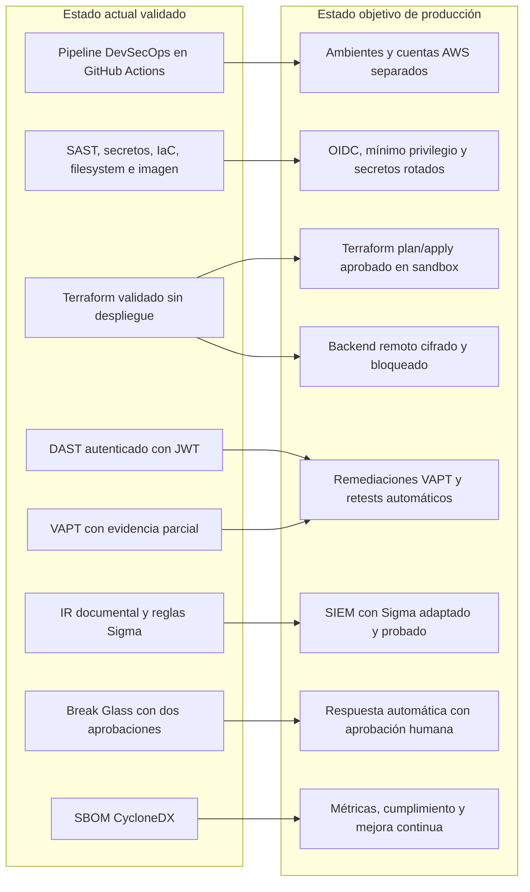

# Estado actual y objetivo de seguridad

## Diagrama

## Lectura del estado

El estado actual demuestra integración y validación estática/dinámica en un entorno de evaluación. El estado objetivo añade controles operativos que requieren autorización, cuentas reales, separación organizacional, remediaciones implementadas y telemetría de producción.

La transición no consiste simplemente en ejecutar `terraform apply`: requiere gestión de cambios, revisión de costos, propietarios de controles, protección de evidencias, pruebas de recuperación y aceptación formal de riesgos residuales.

